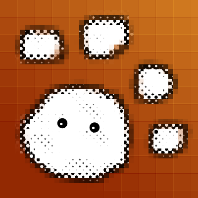

# catchy-web

This is the catchy web. Inspired by the [tadiweb](https://github.com/TodePond/TadiWeb).

## Catchy mindset

While we love to be slippy, the catchy web wants to be catchy too.

*Being catchy means what you create is never bad.*

Everything you do is good as long as it is fun. No fun, no catchy.
If others have fun too, they must share the fun.

## start here

### blog

- [maunzCache](./blog/maunzCache/hi.md)

### games

- ~~10 checkboxes~~
- ~~100 checkboxes~~
- [1000 checkboxes](./games/1000-checkboxes.md)
- [Decide what to eat](./games/decide-what-to-eat.md)

### concept

- [catchy-lang](./concept/catchy-lang.md)

## migration

We are now at <https://catchy-web.github.io/catchy-web/>!

If you want to move probably type
`git remote set-url origin git@github.com:catchy-web/catchy-web.git`
